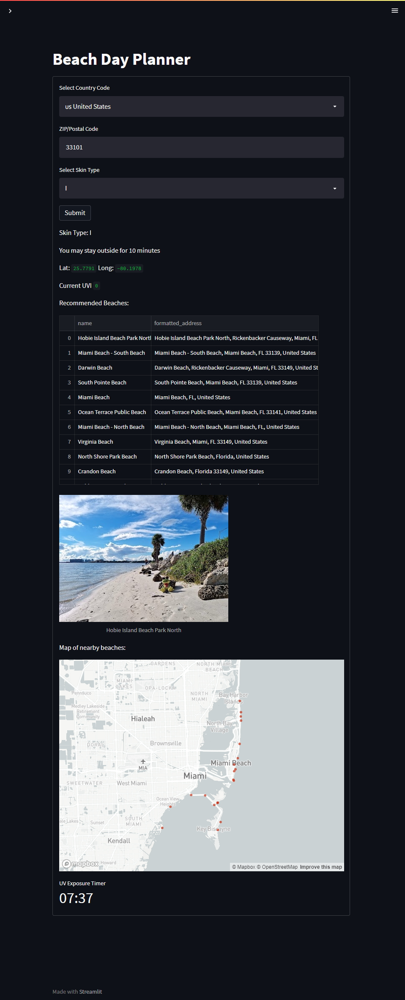
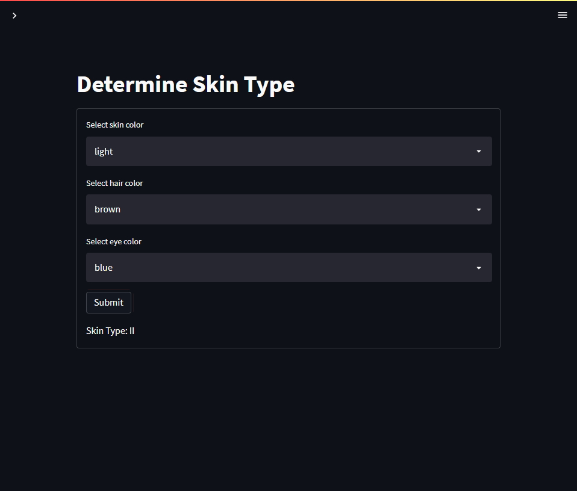

# Beach Day Planner

An app for planning a beach day. Made with Python and Streamlit. This app allows you to enter a ZIP code and skin type to show you nearby beaches, the current UV, and how you should prepare based on your sensitivity to UV. There is a timer built in to let you know when you should get out of the sun. To help, a page lets you select your skin color, hair color, and eye color to tell you what skin type you have.

[Link to live demo](https://share.streamlit.io/jameskha/spfmonitoring/main/UV.py)

